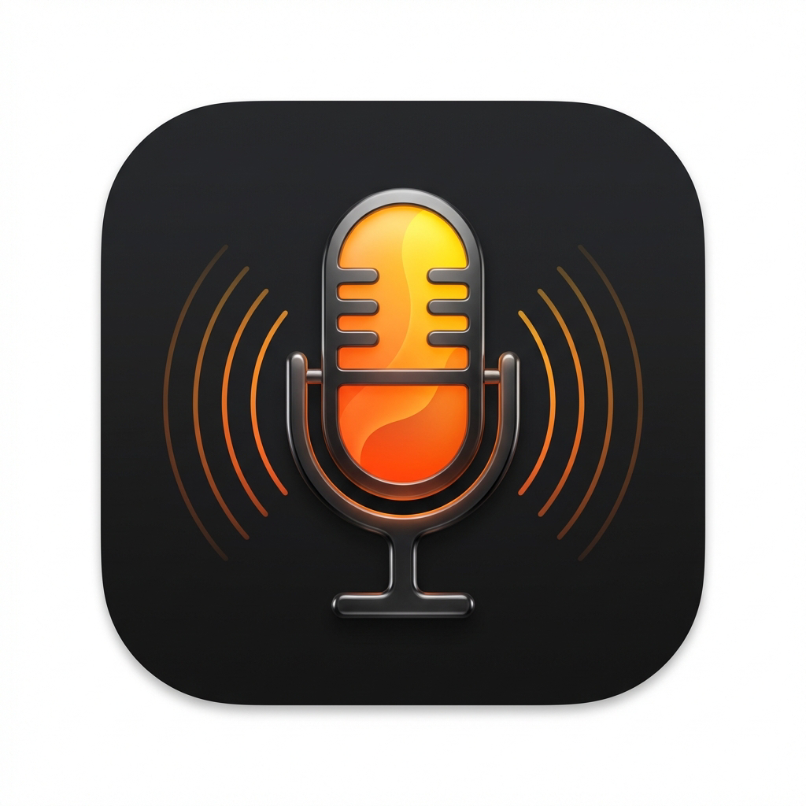

<p align="center">
  
</p>

<h1 align="center">Supervoxtral</h1>

<p align="center">
  Blazingly-fast realtime speech-to-text for macOS, powered by <a href="https://mistral.ai/">Mistral AI</a>'s Voxtral model running locally on Apple Silicon via <a href="https://github.com/ml-explore/mlx-swift">MLX</a>.
</p>

<p align="center">
  <a href="https://github.com/jphme/supervoxtral/releases/latest"></a>
  <a href="LICENSE"></a>
  
  
</p>

---

## Features

- **Realtime streaming transcription** -- text appears at your cursor as you speak, with near-zero latency
- **Works everywhere** -- types directly into any app (editors, terminals, chat, browsers) via macOS Accessibility
- **100% local & private** -- the model runs entirely on your Mac; no audio ever leaves your device
- **Prompt-friendly** -- optional prefix/suffix wrapping (e.g. `<transcript>...</transcript>`) so LLMs know the text is dictated, perfect for vibe-coding and AI workflows
- **Custom vocabulary** -- boost recognition of domain-specific terms, product names, or technical jargon via content bias
- **Lightweight menubar app** -- lives in your status bar, toggle with a hotkey (default: right Command key)

## Requirements

|   | Minimum |
| --- | --- |
| **macOS** | 14.0 (Sonoma) |
| **Chip** | Apple Silicon (M1 / M2 / M3 / M4) |
| **Memory** | 16 GB unified memory |

## Installation

### Download (recommended)

Grab the latest `.dmg` from the [Releases page](https://github.com/jphme/supervoxtral/releases/latest), open it, and drag **Supervoxtral** into your Applications folder.

### Build from source

```bash
git clone https://github.com/jphme/supervoxtral.git
cd supervoxtral
./scripts/build_app.sh
open dist/Supervoxtral.app
```

> Requires Xcode command-line tools and Python `mlx==0.30.3` for the Metal shader library. See [Building](#building-from-source) below for details.

## Quick Start

1. Launch **Supervoxtral** -- it appears as a microphone icon in your menubar.
2. On first launch, grant **Microphone** and **Accessibility** permissions when prompted.
3. The model downloads automatically (~4 GB, cached for future launches).
4. Press and hold the **right Command** key to dictate. Release to stop.
5. Text streams live into whatever app has focus.

## Configuration

Open **Preferences** from the menubar icon to configure common settings through the GUI. Advanced settings can be edited in:

```text
~/Library/Application Support/Supervoxtral/settings.json
```

### Hotkey

Default: `right_cmd` (right Command key). Change via Preferences or `"hotkey"` in settings.

### Content Bias (Custom Vocabulary)

Boost recognition accuracy for specific terms by adding them to the `contentBias` list:

```json
{
  "contentBias": ["Supervoxtral", "MLX", "Kubernetes", "PostgreSQL"],
  "contentBiasStrength": 5.0
}
```

This uses local trie-based logit boosting -- no cloud calls, no extra latency.

### Transcript Prefix / Suffix

Wrap dictated text with markers so downstream tools know it's a transcript:

```json
{
  "transcriptPrefix": "<transcript>\n",
  "transcriptSuffix": "\n</transcript>"
}
```

The prefix is injected when dictation starts, the suffix when it stops. Useful for prompt engineering and AI-assisted workflows.

### Language

Set `"language"` to an ISO code (e.g. `"en"`, `"de"`, `"fr"`) or leave as `"auto"` for automatic detection.

## Permissions

Supervoxtral requires two macOS permissions:

- **Microphone** -- for audio capture during dictation
- **Accessibility** -- for typing text into the focused application

Both can be granted from the menubar menu or System Settings > Privacy & Security.

## Troubleshooting

| Problem | Solution |
| --- | --- |
| Text doesn't appear | Grant Accessibility permission in System Settings > Privacy & Security > Accessibility |
| No audio input | Grant Microphone permission; check that the correct input device is selected |
| Model download stalls | Set `HF_TOKEN` environment variable if using a gated model |
| High memory usage | Ensure you have at least 16 GB RAM; close memory-heavy apps during first model load |

Logs: `~/Library/Logs/Supervoxtral/app.log`

```bash
tail -f ~/Library/Logs/Supervoxtral/app.log
```

---

## Building from Source

### Prerequisites

- macOS 14+, Apple Silicon
- Xcode command-line tools (`xcode-select --install`)
- Python `mlx==0.30.3` (for the Metal shader library)

### Build App Bundle

```bash
./scripts/build_app.sh
open dist/Supervoxtral.app
```

### Build Installable DMG

```bash
./scripts/build_dmg.sh
open dist/Supervoxtral-$(cat VERSION).dmg
```

### Run from Source (development)

```bash
swift run --disable-sandbox supervoxtral
```

### Tests

```bash
swift test --disable-sandbox -c debug --filter "(ContentBiasProcessorTests|SettingsTests)"
```

### Release

```bash
./scripts/release_github.sh v0.1.0
```

Pushes a tag, builds the DMG, and creates a GitHub Release. Add `--draft` for draft releases. CI (`.github/workflows/release.yml`) also builds on tag push.

## License

Supervoxtral is open source under the [MIT License](LICENSE).
